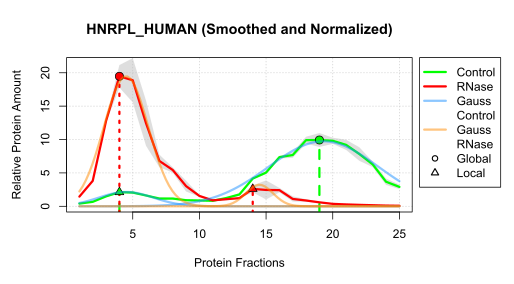

  <ul>
    
Data Analysis Project 2023
      <h1 style="display: inline-block;">Topic 3: Proteome-wide Screen for RNA-dependent Proteins</h1>
  

    </ul>

<h2> Subtopic 3: HeLa Cells Synchronized in Interphase </h2>
  
Contributors: Hannah Brehm, Johann Blakytny, Kira Hoffmann, Viktor Bonin

 

 Figure 1: Smoothed and normalized protein distribution with peak determination and gaussian fitting of the heterogeneous nuclear ribonucleoprotein (HNRPL_HUMAN). The grey area indicates the 95% confidence interval of the mean.

### About

In this project, we investigated RNA dependence in the human proteome by analyzing the protein distributions of 7086 genes in HeLa cells synchronized in interphase (data provided by Caudron-Herger *et al.*, 2020) (see **Figure 1**). The protein distributions were obtained from untreated and RNase-treated cell lysates separated on a sucrose gradient into 25 fractions. The proteins in each fraction were examined using mass spectrometry.

### Files on this Repository

| Name | Description |
| --- | --- |
| `Project_Report.pdf` | Documentation of project, including an Introduction, Materials & Methods, Results and Discussion |
| `Markdown.Rmd` | R code used to generate the project report |
| `Project_Presentation.pdf` | Slides of the presentation of project results |
| `HeLa Cells Synchronized in Interphase.Rmd` | Entire R code that was used for analysis |
| `Environment.RData` | R workspace containing all dataframes generated and used in our analysis |
| `Table_HS_Non_RBP.RData` | R workspace that contains the dataframe for all non RBPs from the RBP2GO databank |
| `Datensätze.xlsx` | Excel spreadsheet describing all dataframes contained in `Environment.RData` (in German) |
| `Project_Proposal` | Folder that contains .pdf and .pptx versions of the initial project proposal with planned analysis steps |
| `README.md` | This file |
| `HNRPL_HUMAN.svg` | Vector graphic used for figure 1 |
